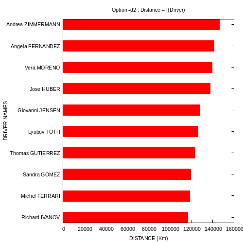
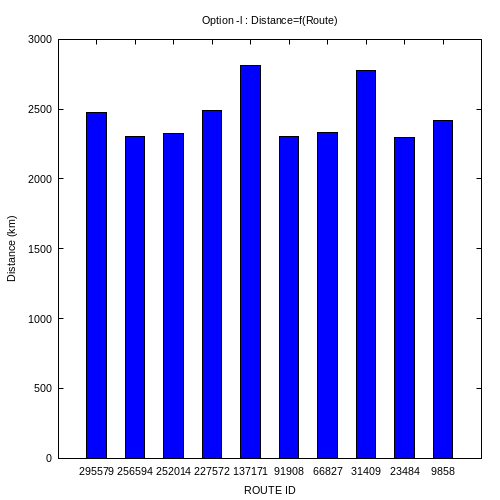
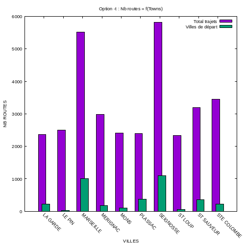

# Projet CY-TRUCKS 
#### (v1.0.2)

<p align="center"> 🚛🚛🚛🚛🚛🚛🚛🚛🚛🚛🚛 </p>
<p align="center"> 🚛  𝘽𝙞𝙚𝗻𝑣𝐞𝙣𝘂𝘦 𝑎̀ 𝘾𝑌-𝙏𝑅𝑈𝘾𝘒𝙎 🚛 </p>
<p align="center"> 🚛🚛🚛🚛🚛🚛🚛🚛🚛🚛🚛 </p>

## Description du projet

Ce projet vise à réaliser un programme qui va analyser le contenu du fichier de données et générer des graphiques résumant le contenu de ce fichier pour une société nationale de transport routier.

## Fonctionnalités
Les options possibles avec script.sh sont: 
- **[-h]** Afficher l'aide
- **[-d1]** Conducteurs avec le plus de trajets
- **[-d2]** Conducteurs avec la plus grande distance
- **[-l]** Les 10 trajets les plus longs
- **[-t]** Les 10 villes les plus traversées
- **[-s]** Statistiques sur les étapes *((EN COURS DE REALISATION))*

### Option [-d1] : Les 10 Conducteurs avec le plus de trajets
***Exécution :***
```
./script.sh data/data.csv -d1
```
***Durée du traitement :*** 2 secondes

***Résultat :***


### Option [-d2] : Les 10 Conducteurs avec la plus grande distance
***Exécution :***
```
./script.sh data/data.csv -d2
```
***Durée du traitement :*** 5 secondes

***Résultat :***



### Option [-l] : Les 10 trajets les plus longs
***Exécution :***
```
./script.sh data/data.csv -l
```
***Durée du traitement :*** 8 secondes

***Résultat :***



### Option [-t] : Les 10 villes les plus traversées
***Exécution :***
```
./script.sh data/data.csv -t
```

***Résultat :***



### Option [-s] : Statistiques sur les étapes
*En cours de réalisation. Pas de résultat Final.*

Techniquement la partie AVL correcpondantes est en cours de réalisation. *(voir fichier statistiques.c)*

## Rapport
Ci-joint le Rapport-CYTRUCKS.pdf qui contient tous le détail technique et fonctionnnels de ces traitements ainsi que les captures d'éxécutions.

### ⚠️⚠️ *Note* ⚠️⚠️
Ajouter **data.csv** dans le dossier ***data*** pour faire les testes.

## Réalisé par

- Dikra BOUHORMA
- Bayane BENAMEUR
